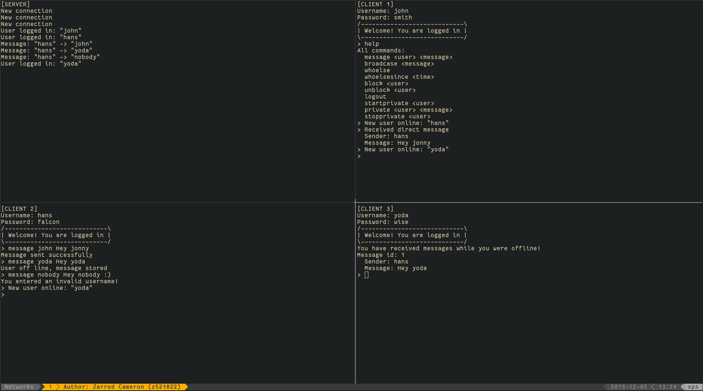

# COMP3331 - Major Assignment

This is a client/server and peer to peer network application
for sending messages.
After the server is running each _client_ can log in and send messages
via the server. A peer to peer connection can be established after logging
in to communicate to other clients.

The internal implementation can be seen in `docs/report.pdf`.

## Compilation

The dependencies are:

- `make`
- `gcc`
- `pthread`'s library

All of these should be installed by default on most Linux distributions.
To compile run `make` in the root directory. To clean the root directory
run `make run`.

The `server` and `client` elf file should be in the root directory after
compilation.

## Running Client/Server

To run the server:

> ./server <server_port> <block_duration> <timeout>

To run the client:

> ./client <host_name> <server_port>

NOTE: The `server` needs to be run before the `client`.

| Argument | Usage |
| -------- | ----- |
| `server_port` | The port for the server to listen to and the client to connect to. |
| `block_duration` | Number of seconds to blocker a user after 3 invalid login attempts. |
| `timeout` | Number of seconds before logging a user out due to inactivity. |
| `host_name` | The host name or IPv4 address (IPv6 is not supported) of the server. |

After logging in, use the `?` or `help` command to get a list of available
commands.

## Logging In

The credentials for all clients are stored in `credentials.txt`. The user name
and password are space separated. For example

```{sh}
$ cat credentials.txt
john smith
hans falcon
yoda wise
...
```

The `john`, `hans`, `yoda`, user names
have to corresponding passwords `smith`, `falcon`,
and `wise`.

## `run.sh`

The `run.sh` script can be executed using the command:

> bash run.sh

This will compile the code and create a `tmux` session with one
server and three clients. The `netstat` program is used to find a free
port. It is possible `tmux` and `netstat` are not installed.
Use the following command to install the dependencies on Debian based
distributions (e.g. Ubuntu):

```{sh}
apt update && apt install tmux net-tools
```

NOTE: There is a slight delay after running the script. This ensures the server
is initialised before the clients connect.

### Obligatory screen shot


